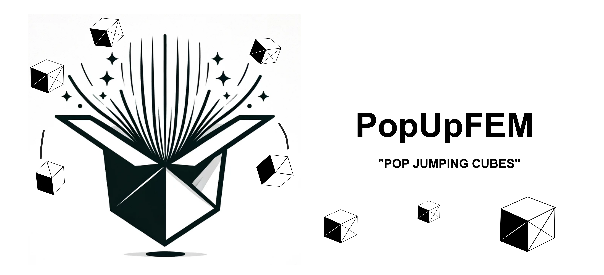

<div align="center">
    
</div>

# PopUpFEM : Automated Abaqus/Python model generation for jumping cubes

### Introduction
Poping boxes is a project developed using Abaqus/Python scripting, in order to simulate the behavior of origami like folded boxes, with a rubber band attached. This is commonly known as Pop Jumping Cubes, and there are a lot of videos on Youtube on how to make them yourself.

Examples:
- [Pop Up Cubes Card Tutorial - From DIY Blaster](https://www.youtube.com/watch?v=PdaHHFXTUxQ)
-  [Pop up Cubes in a box Tutorial - From Srushti Patil](https://www.youtube.com/watch?v=h3P-WZ2uPx0&t)
-  [How to Make BOOMF Jumping Box Pop Up Cube - From Joy in Crafting](https://www.youtube.com/watch?v=jKvsseAAZmo)

This project was initially conceived as a "Kitchen Mechanics" project using Abaqus Python scripting, which was challenged to me by a colleague.
<div align="center">
   
    Figure 1: Jumping cubes.
</div>

### Dependencies
* [Simulia Abaqus](https://www.3ds.com/products-services/simulia/products/abaqus) 2017 or later
* [FFmpeg](https://ffmpeg.org) (optional, to create animated gifs of the results)

### Quick start

The files `main.py.py`, `parts_dics_gen.py` and an input file must be in your working directory. You can choose one of the provided input files, such as `input_Case_1_2D.py`. You can run the PopUpFEM with the command `abaqus cae noGui=input_Case_1_2D.py` or `abaqus cae script=input_Case_1_2D.py` if you desire the Abaqus CAE GUI. This runs the first test case of PopUpFEM which is a simple "2D" Pop Up Box (more will be detailed later). The file can be changed and is customizable and the dictionaries `main_dict` `BC_dict` and `model_def` can be changed according to your preferences.

The syntax in the input dictionaries and the details of the model are described in the following sections. 

### 1. Using the script

The script is mainly composed by three main dictionaries, the `main_dict` where the main model parameters are defined, the `BC_dict` with the important boundary conditions and the `model_def` where stacks of box units are defined with the specified colors.

```python
main_dict = {
    'sim_name': 'Case_1',       # Simulation name
    'modelName': 'Pop_Box',     # Model name
    'Modeltype' : '3D',         # Model type: can be either "2D" or "3D"
    'l': 65.0,                  # Side length [mm]                 
    't': 0.3,                   # Shell/Paper thickness [mm]
    'E': 2000.0,                # Young's Modulus of the material [MPa]
    'Poisson': 0.3,             # Poisson of the material [-]
    'density': 5.0E-10,         # Density of the material [tonne/mm^3]
    'scale_factor': 20.0,       # Table scale in relation with the box [-]
    'time_period': 1.2,         # Simulation time [s] 
    'num_intervals': 20,        # Number of frames/intervals [-]
    'nCPU' : 6,                 # Number of CPUs to be used
    'Job_name': '1_c_2D',       # Job name. If no name is given, an automatic name is attributed
    'run_job': True}            # Runs the job after generating the model - Typically work best with ABAQUS noGui 
```


```python
BC_dict = {
    'fold_angle': 6.0,          # Fold angle [deg]
    'band_stiff': 0.0077,       # Spring stiffness [N/mm]
    'ref_length': 85.0,         # Spring reference length [mm]
    'gravity_constant': 9810,   # Gravity constant [mm/s^2]   
    'friction_coef': 0.4}       # Coefficient of friction [-]
```


```python
model_def = {
    'Box':
        {'l_X':2*main_dict['l']+20,'l_Y':3*main_dict['l']+100,'l_Z':3*z,'Lid':False},
    'S1':
        {'n':3,'dX':0.0,'dY':0.0, 'colors' : ['Very Light Gray', 'Light Gray', 'Dark Gray']},
    'S2':
        {'n':3,'dX':0.0,'dY':main_dict['l']+10.0 , 'colors' : ['Salmon', 'Light Orange', 'Sand Red']},
    'S3':
        {'n':3,'dX':0.0,'dY':-main_dict['l']-10.0, 'colors' : ['Very Light Gray', 'Light Gray', 'Dark Gray']}}
```


<p align="center">

Figure 2: Structure of the model function <code>make_model</code> that creates, runs, and evaluates the Lego model from the input dictionaries <code>assembly</code>, <code>explicit_par</code>, and <code>lego_geom</code>. Note that <code>lego_geom</code> is optional. By default, it contains  basic Lego dimensions and the Lego material properties.
</p>

As observed, it's feasible to designate colors for the various cubes in each stack. Below is the comprehensive color library used in the script:

```python
color_lib = {
     'White': 'ffffff', 'Very Light Gray': 'e5e5e5', 'Light Gray': '919191', 'Dark Gray': '615050',
     'Black': '1e1e1e', 'Dark Red': '631116',
     'Red': 'b10b0f', 'Coral': 'ff7669', 'Dark Salmon': 'ff592a', 'Salmon': 'ff7256',
     'Light Salmon': 'ffc0af', 'Sand Red': 'c28276', 'Brown': '633721',
     'Dark Orange': 'b04a17', 'Rust': 'af401c', 'Neon Orange': 'ff5041', 'Orange': 'ff7324',
     'Medium Orange': 'ff9a38', 'Bright Light Orange': 'ffbe2c', 'Light Orange': 'ffb23f',
     'Very Light Orange': 'ffd69e', 'Dark Yellow': 'de8c34', 'Yellow': 'ffda32',
     'Light Yellow': 'ffe39a', 'Bright Light Yellow': 'ffec89', 'Neon Yellow': 'fff938',
     'Neon Green': 'd5ef5b', 'Light Lime': 'e9eab8','Medium Lime': 'dcd931', 
     'Fabuland Lime': 'a1ca41', 'Lime': 'bbd930', 'Dark Olive Green': '6b693b',
     'Medium Green': '7ed986', 'Light Green': 'cfebcc', 'Sand Green': '95b69a',
     'Dark Turquoise': '009794', 'Light Turquoise': '00bdb4', 'Aqua': 'afe1d7', 'Light Aqua': 'c5ece7',
     'Dark Blue': '1e314c', 'Blue': '004f99', 'Dark Azure': '0096d8', 'Little Robots Blue': '43b7de',
     'Maersk Blue': '69b9d1', 'Medium Azure': '50c7da', 'Sky Blue': '76cedc', 'Medium Blue': '71a4d0',
     'Bright Light Blue': 'b1cbe9', 'Light Blue': 'bfd4dc', 'Sand Blue': '7b8fa0',
     'Dark Blue-Violet': '1731a2', 'Violet': '2a4296', 'Blue-Violet': '4065e7', 'Lilac': '6d5bc3'}
```
Most of these colors were sourced from [BrickFEM](https://github.com/mpletz/BrickFEM/tree/main), which served as a significant inspiration for many features in this script. You can add additional colors to this dictionary by simply updating it in the `post_processing.py` script.


#### 1.1 Definition of the stack and box unit

#### 1.2 Dimensions and other parameters

#### 1.3 Running the model

#### 1.4 Output of the model

### 2. Under the hood

#### 2.1 General assumptions

#### 2.2 Definition 

### 3. Some use cases

### 4. Possible issues
There are a few potential issues to be aware of when using this script due to certain assumptions and limitations:

- **Plate Buckling:** In certain model conditions, particularly when there is a combination of stiffness in the spring and shell materials alongside the utilization of small angles, plate buckling may occur. This phenomenon can prevent the cube from unfolding as anticipated.
- **Interaction Modes:** The script can be invoked in two ways: interactively or in the background. Interactively, you can use `abaqus cae script=script.py` in the command line or within an open Abaqus CAE window. Alternatively, you can run it in the background with `abaqus cae nogui=script.py` in the command line. Note that the `waitForCompletion` command, used to pause execution until the solver finishes, may cause crashes when Abaqus is called interactively. This issue is a known bug in Abaqus.
- **Script Looping:** Running the script within a loop might encounter issues, possibly related to the `waitForCompletion` command. A robust alternative for running multiple simulations is to set `run_job` to false and then execute all model simulations simultaneously or sequentially. Another approach is to open a separate instance of Abaqus CAE for each model creation and run each model separately. This could be achieved using Python 3, where model properties can be written to a .json file before running the script. Abaqus can then be invoked using the subprocess library to execute `abaqus cae noGui` from the command line. However, implementing this approach would require significant code restructuring, which is not currently planned for future updates.

### 5. Possible updates
While there are various aspects of the script that could be enhanced, there are no immediate plans for future updates. The current version of the script can be considered final, with the possibility of minor updates or fixes at most.
