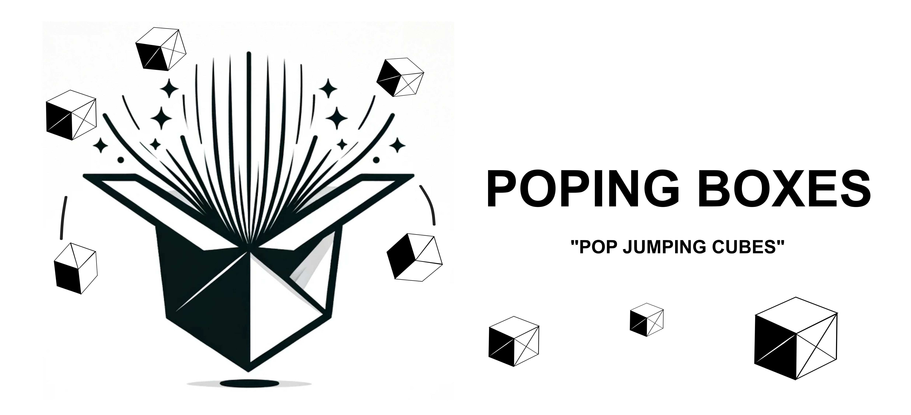
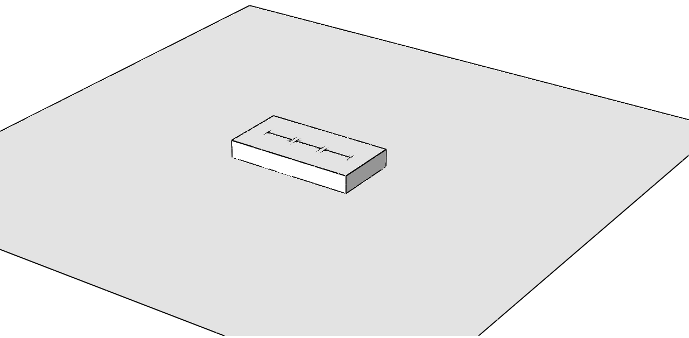

    

# PopUpBoxesFEM : Automated Abaqus/Python model generation for jumping cubes

### Introduction
Poping boxes is a project developed using Abaqus/Python scripting, in order to simulate the behavior of origami like folded boxes, with a rubber band attached. This is commonly known as Pop Jumping Cubes, and there are a lot of videos on Youtube on how to make them yourself.

Examples:
- [Pop Up Cubes Card Tutorial - From DIY Blaster](https://www.youtube.com/watch?v=PdaHHFXTUxQ)
-  [Pop up Cubes in a box Tutorial - From Srushti Patil](https://www.youtube.com/watch?v=h3P-WZ2uPx0&t)
-  [How to Make BOOMF Jumping Box Pop Up Cube - From Joy in Crafting](https://www.youtube.com/watch?v=jKvsseAAZmo)

This project was initially conceived as a "Kitchen Mechanics" project using Abaqus Python scripting, which was challenged to me by Martin Pletz in the 

   
    Figure 1: Jumping cubes.

### Dependencies
* [Simulia Abaqus](https://www.3ds.com/products-services/simulia/products/abaqus) 2017 or later
* [FFmpeg](https://ffmpeg.org) (optional, to create animated gifs of the results)

### Quick start

### 1. Using the script

#### 1.1 Definition of the stack and box unit

#### 1.2 Dimensions and other parameters

#### 1.3 Running the model

#### 1.4 Output of the model

### 2. Under the hood

#### 2.1 General assumptions

#### 2.2 Definition 
